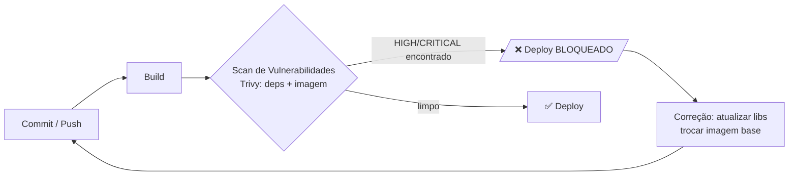

# 🛡️ Scan de Vulnerabilidades — Astra API (Módulo DevSecOps)

> **Implementação prática** da Global Solution (item 3 do enunciado):
> **"Configurar um scan de vulnerabilidades em dependências ou contêineres."**
> Cobrimos **os dois** com uma única ferramenta: o **[Trivy](https://trivy.dev)**.

Este controle escaneia o backend, **detecta** as falhas plantadas (ver
[`../VULNERABILITIES.md`](../VULNERABILITIES.md)) e — depois de corrigidas —
**comprova** que sumiram. O ciclo completo está documentado em
**antes × depois** abaixo.

---

## 📋 O que é escaneado

| # | Alvo | Comando Trivy | Detecta | Risco do PDF |
|---|------|---------------|---------|--------------|
| 1 | **Dependências** (`package-lock.json`) | `trivy fs --scanners vuln` | CVEs de libs npm (SCA) | **V2 – Dependências inseguras** |
| 2 | **Imagem Docker** | `trivy image` | CVEs do SO + libs da imagem | **V3 – Imagem vulnerável** |
| + | **Dockerfile** (IaC) | `trivy fs --scanners misconfig` | Erros de config (root, etc.) | **V3** (bônus) |
| + | **Segredos** | `trivy fs --scanners secret` | Tokens de provedores conhecidos | **V1** (bônus, ver ressalva) |

Tudo num único script: [`scan-trivy.sh`](./scan-trivy.sh).

---

## ▶️ Como rodar

**Pré-requisito:** Docker instalado e rodando. *Não precisa instalar o Trivy* —
ele roda pela imagem oficial `aquasec/trivy`.

```bash
cd API/security
./scan-trivy.sh                                  # report-only (default)
SEVERITY=MEDIUM,HIGH,CRITICAL ./scan-trivy.sh    # inclui MEDIUM
EXIT_CODE=1 ./scan-trivy.sh                       # modo GATE (falha o build)
IMAGE_NAME=astra-api:fixed ./scan-trivy.sh        # escaneia uma imagem específica
```

Saída em [`reports/`](./reports): `01-deps-fs.txt/.json` (deps/segredos/misconfig)
e `02-image.txt` (imagem).

---

## 📊 Resultado: ANTES × DEPOIS (limiar `HIGH,CRITICAL`)

| Alvo | 🔴 ANTES (vulnerável) | 🟢 DEPOIS (corrigido) |
|------|----------------------|-----------------------|
| **Dependências** (`package-lock.json`) | **22** (21 HIGH, 1 CRITICAL) | **0** |
| **Dockerfile** (misconfig) | **1 HIGH** (roda como root) | **0** |
| **Imagem — SO** | **562** (541 HIGH, 21 CRITICAL) — Debian 10 (`node:14`) | **0** — Alpine 3.23 (`node:20-alpine`) |
| **Imagem — libs Node** | 41 (+ npm embutido) | **0** (npm removido da imagem) |
| **Gate** (`EXIT_CODE=1`) | `exit 1` → **deploy BLOQUEADO** | `exit 0` → **deploy APROVADO** |

- **ANTES:** `reports/antes/` — destaques: `lodash@4.17.4` (CVE-2019-10744 CRITICAL),
  `axios@0.21.1` (14 CVEs), imagem `node:14` com 562 CVEs de SO.
- **DEPOIS:** `reports/` (raiz) — tudo zero. Ver `04-gate-pass.txt`.

### ⚠️ Ressalva honesta sobre segredos (V1)

O scanner de **secret** do Trivy não flagrou os segredos hardcoded
(`config.js`/`.env`): ele usa padrões de provedores conhecidos (AWS, GitHub…) e
essas strings eram genéricas. Para o risco **V1**, a ferramenta correta é o
**[gitleaks](https://github.com/gitleaks/gitleaks)** ou o **GitHub Secret
Scanning**. A correção do V1 (remover segredos + tirar o `.env` do Git) foi
feita mesmo assim — ver `../VULNERABILITIES.md`.

---

## 🚦 Simulação de pipeline (item 4 do PDF) — detectar → bloquear → corrigir → passar

1. **Problema:** dependências e imagem com CVEs HIGH/CRITICAL.
2. **Controle detecta:** `EXIT_CODE=1 ./scan-trivy.sh` → Trivy retorna `exit 1`.
   → **deploy bloqueado** (evidência: `reports/antes/03-gate-demo.txt`).
3. **Correção aplicada:** libs atualizadas, imagem `node:20-alpine` não-root,
   segredos removidos, endpoints-exploit removidos.
4. **Gate passa:** mesmo comando agora retorna `exit 0` → **deploy aprovado**
   (evidência: `reports/04-gate-pass.txt`).

---

## 🔧 Onde isso entra no pipeline CI/CD



> Para um time real, o passo **C** vira um job de CI (ex.: GitHub Actions) com
> `EXIT_CODE=1`. Aqui é demonstrado localmente.

---

## 📁 Arquivos desta pasta

| Arquivo | Descrição |
|---------|-----------|
| `scan-trivy.sh` | Script do scan (deps + imagem), via Docker. |
| `reports/antes/` | Evidência do estado **vulnerável** (01 deps, 02 imagem, 03 gate-fail). |
| `reports/01-deps-fs.txt` / `.json` | Estado **corrigido**: dependências/segredos/misconfig. |
| `reports/02-image.txt` | Estado **corrigido**: imagem Docker. |
| `reports/04-gate-pass.txt` | Evidência do gate **aprovando** o deploy após a correção. |
| `.trivycache/` | Cache do banco de CVEs (não versionado). |
